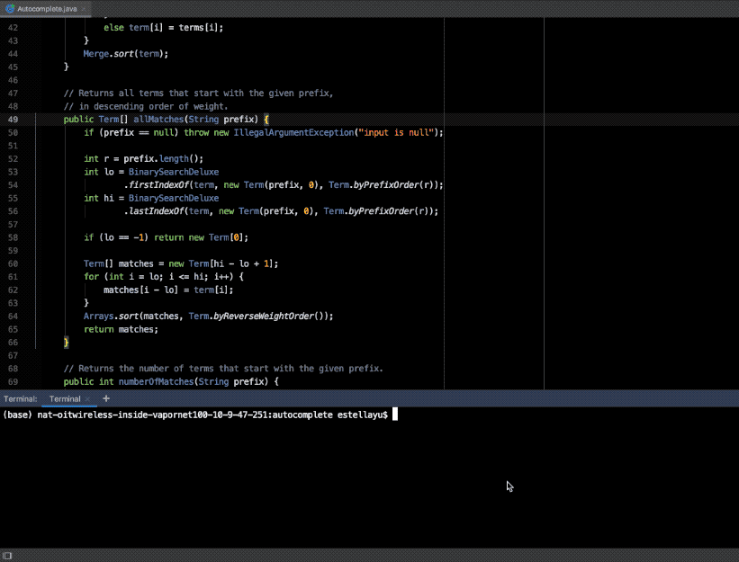

# AutoComplete
Write a program to implement autocomplete for a given set of n terms, where a term is a query string and an associated non-negative weight. That is, given a prefix, find all queries that start with the given prefix, in descending order of weight.
<p align="center">
  
</p>
<hr>

## Term
Write an immutable data type `Term.java` that represents an `autocomplete term` -— a query string and an associated integer weight. The following API supports comparing terms by three different orders: `lexicographic order` by query string (the natural order); in `descending order by weight` (an alternate order); and `lexicographic order by query string but using only the first r characters` (a family of alternate orderings). The last order will be used in Part 3 to find all query strings that start with a given prefix (of length r).

```java
public class Term implements Comparable<Term> {

    // Initializes a term with the given query string and weight.
    public Term(String query, long weight)

    // Compares the two terms in descending order by weight.
    public static Comparator<Term> byReverseWeightOrder()

    // Compares the two terms in lexicographic order,
    // but using only the first r characters of each query.
    public static Comparator<Term> byPrefixOrder(int r)

    // Compares the two terms in lexicographic order by query.
    public int compareTo(Term that)

    // Returns a string representation of this term in the following format:
    // the weight, followed by a tab, followed by the query.
    public String toString()

    // unit testing (required)
    public static void main(String[] args)

}
```

##  binary search. 
When binary searching a sorted array that contains more than one key equal to the search key, the client may want to know the index of either the first or the last such key. Accordingly, implement the following API:
```java
public class BinarySearchDeluxe {

    // Returns the index of the first key in the sorted array a[]
    // that is equal to the search key, or -1 if no such key.
    public static <Key> int firstIndexOf(Key[] a, Key key, Comparator<Key> comparator)

    // Returns the index of the last key in the sorted array a[]
    // that is equal to the search key, or -1 if no such key.
    public static <Key> int lastIndexOf(Key[] a, Key key, Comparator<Key> comparator)

    // unit testing (required)
    public static void main(String[] args)
}

```

## autocomplete. 
Implement a data type that provides autocomplete functionality for a given set of string and weights, using **Term** and **BinarySearchDeluxe**. To do so, 
1. sort the terms in lexicographic order; 
2. use binary search to find the all query strings that start with a given prefix; 
3. sort the matching terms in descending order by weight. 
Organize the program by creating an immutable data type Autocomplete with the following API:

```java
public class Autocomplete {

    // Initializes the data structure from the given array of terms.
    public Autocomplete(Term[] terms)

    // Returns all terms that start with the given prefix, in descending order of weight.
    public Term[] allMatches(String prefix)

    // Returns the number of terms that start with the given prefix.
    public int numberOfMatches(String prefix)

    // unit testing (required)
    public static void main(String[] args)

}
```


